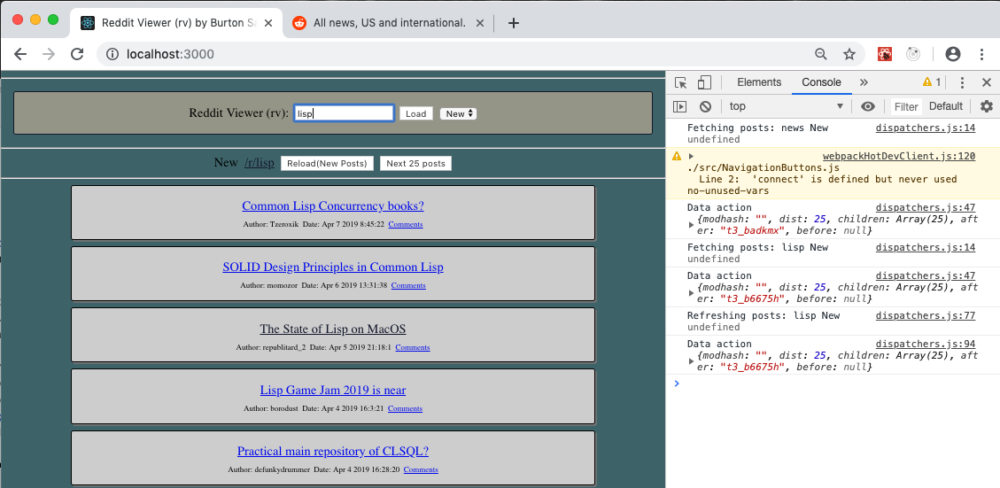

Reddit Viewer (rv)
==



A simple subreddit viewer written in React and Redux.

Features:

	- all links open in new tab
	- thumbnails if present for post
	- selectable view (Hot, New or Top)
	- ability to page for next 25 posts
	- notification in Reload button for new posts

Building:
--

```$ yarn install && yarn build # output will be found in the build/ directory```

Usage:
--

```$ node server```

This will build the production site and run the fetching server on
port 3000 by default. 

You can use the PORT environment variable to change this:

```$ PORT=8080 node server```

Open your browser at http://localhost:3000/ to view the application.

Enter a Subreddit, select the View (New, Hot, Top) and hit enter or
click the 'Load' button to load a different Subreddit View.

The top 25 posts will be shown for the selected View.

Development:
--

To start the build process and development server:

```$ yarn start # starts proxying development server```

To start the main server:

```$ nodemon server/```


All browser requsts are proxied to the development server.

Testing
--

All components are tested to be sure they do not crash when rendering.

TODO: More thorough testing could be done, using a mock server and
json data.

Design Notes:
--

There should be very little suprises on the usage of React and Redux.
Actions are in actions.js, dispatchers in dispatchers.js and reducers
in reducers.js.  All other files are React components.

Due to in brower CORS safetry restrictions, an external server/ is used
to fetch the JSON data from reddit.com.

Caching
--

The server contains a basic 60 second timed cache to help with scaling
the service by caching frequently fetched urls, like "news (New)".
The cache time can be set using the CACHE_SECONDS environment variable
on start.

Notes:
--

By default it will load posts from the the /r/news (New) page.


TODO:

-- find and show the first sentences of the top 3 top level comments
   for stories through a click of a button

-- backup and mirror headline stories using wget

--
Burton Samograd

2019

